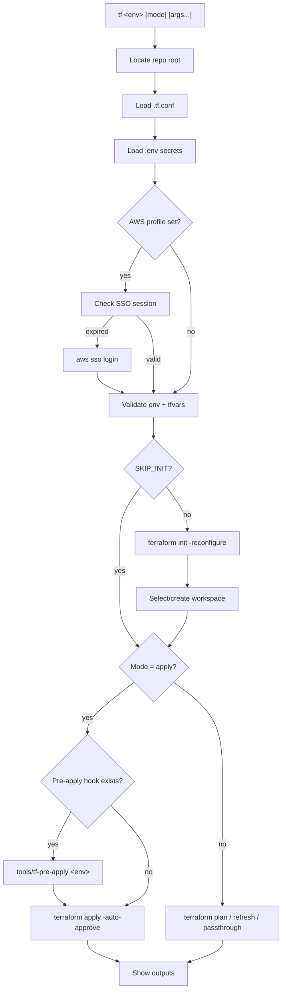

# terraform-wrapper

Configurable Terraform CLI wrapper with SSO auth, workspace management, and env-aware plan/apply.

## Install

```bash
# Clone and symlink
git clone git@github.com:ng/terraform-wrapper.git ~/.terraform-wrapper
ln -s ~/.terraform-wrapper/tf /usr/local/bin/tf

# Or copy directly into a project
cp tf /path/to/your-terraform-repo/tools/tf
```

## Usage

```bash
tf <env> [mode] [extra-tf-args...]
```

| Mode      | Description                          |
|-----------|--------------------------------------|
| `plan`    | `terraform plan`                     |
| `apply`   | `terraform apply -auto-approve`      |
| `refresh` | `terraform refresh`                  |
| `output`  | `terraform output` (passthrough)     |
| `state`   | `terraform state` (passthrough)      |
| `*`       | Any terraform subcommand             |

```bash
tf dev plan                    # Plan dev environment
tf prod apply                  # Apply to production
tf dev output                  # Show dev outputs
tf dev plan -target=module.s3  # Plan with extra args
```

## Configuration

Create `.tf.conf` in your repo root:

```ini
aws_profile  = my-terraform-admin
allowed_envs = dev staging prod
aws_region   = us-west-2
```

| Key            | Default              | Description                          |
|----------------|----------------------|--------------------------------------|
| `aws_profile`  | _(none)_             | AWS CLI profile for SSO auth         |
| `allowed_envs` | `dev prod`           | Space-separated valid environments   |
| `state_bucket` | _(none)_             | S3 state bucket (informational)      |
| `aws_region`   | `us-east-1`          | Default AWS region                   |

## Expected directory structure

```
your-repo/
├── .tf.conf                    # Project config (optional)
├── .env                        # TF_VAR_* secrets (gitignored)
├── terraform/
│   ├── env/
│   │   ├── common.tfvars       # Shared variables
│   │   ├── dev/
│   │   │   ├── backend.conf    # S3 backend config
│   │   │   └── terraform.tfvars
│   │   └── prod/
│   │       ├── backend.conf
│   │       └── terraform.tfvars
│   ├── modules/
│   ├── main.tf
│   └── ...
└── tools/
    └── tf-pre-apply            # Optional hook (executable, runs before apply)
```

## How it works



## Features

- **SSO auto-login**: Detects expired sessions and triggers `aws sso login`
- **Workspace isolation**: Each env gets its own Terraform workspace
- **Backend config**: Per-env `backend.conf` for state isolation
- **Secret loading**: Reads `TF_VAR_*` from `.env` safely (no shell eval)
- **Pre-apply hooks**: Runs `tools/tf-pre-apply <env>` before apply if present
- **Passthrough**: Any terraform subcommand works (`tf dev console`, `tf dev import ...`)
- **SKIP_INIT**: Set `SKIP_INIT=1` to skip init for fast read-only commands
